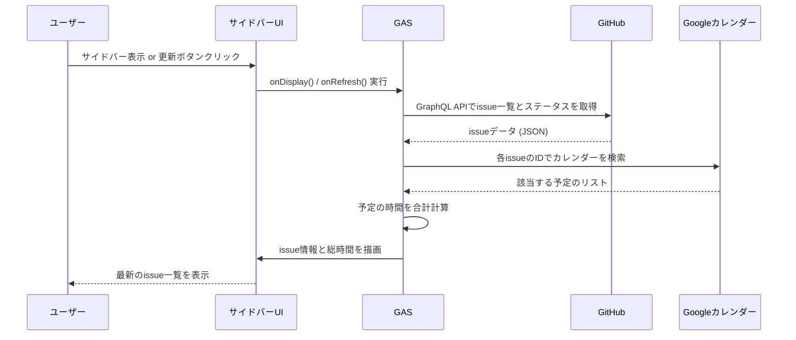

# Google Calendar GitHub Projects連携アドオン開発ドキュメント

## 1. PRD (プロダクト要求仕様書)

### 1.1. 概要

本プロジェクトは、Google Workspaceアドオンとして動作するツールを開発する。このツールはGoogleカレンダーのUIとGitHub Projectsを連携させ、タスク管理と工数記録のプロセスを効率化することを目的とする。

ユーザーはGoogleカレンダーのサイドバーから直接GitHubのissue情報を確認・操作でき、カレンダーに登録された予定時間とissueを紐付けることで、工数の可視化と管理を容易にする。

### 1.2. なぜやるのか

現在、タスク管理はGitHub Projectsで行い、日々の作業実績はGoogleカレンダーに予定として記録している。しかし、両者は独立しており、以下の問題が発生している。

* **工数の転記ミスと手間:** issueが完了した際に、Googleカレンダーの複数の予定を見ながら手動で合計時間を計算し、GitHubの「Actual Hours」フィールドに転記する必要がある。この作業は手間がかかる上に、計算ミスや転記漏れのリスクが伴う。
* **タスク状況の分断:** あるタスク（issue）にどれくらいの時間を費しているかを確認するために、GitHubとGoogleカレンダーの両方を開いて見比べる必要があり、非効率である。

これらの問題を解決し、**工数記録の自動化**と**タスク状況の可視化**を実現することで、開発者の生産性向上と管理コストの削減を目指す。

### 1.3. ユーザーストーリー

* **As a** 開発者,
    **I want to** Googleカレンダーのサイドバーで、担当しているissueの一覧とその現在のステータス（例: In Progress）を確認したい,
    **so that** 今日どのタスクに取り組むべきかをカレンダーから離れずに把握できる。

* **As a** 開発者,
    **I want to** サイドバーに表示されたissueに、現時点でカレンダーに記録されている合計作業時間を表示したい,
    **so that** issue完了前に、どれくらいの工数がかかっているかをリアルタイムで確認できる。

* **As a** 開発者,
    **I want to** サイドバーのissueを選択して、簡単にGoogleカレンダーの予定を作成したい,
    **so that** issue番号を手入力する手間を省き、正確にタスクと予定を紐付けられる。

* **As a** 開発者,
    **I want to** Googleカレンダーの予定作成時に、まだ存在しないタスク（issue）を新規作成したい,
    **so that** 新しいタスクが発生した際に、カレンダーからGitHubへスムーズに起票できる。

### 1.4. プロダクトイメージ

Googleカレンダーの右側にサイドバーとして表示されるアドオン。

* **メインビュー:**
    * 担当するGitHub issueがタイトル、現在のステータス、カレンダー上の総時間と共に一覧表示される。
    * ステータスごとに色分けされ、視覚的に状況を把握しやすい。
    * 手動で情報を最新化するための「更新」ボタンを配置する。
* **操作:**
    * 各issueの横にある「予定作成」ボタンを押すと、そのissueに紐付いた予定作成画面が開く。
    * サイドバー上部にある「新規issue作成」ボタンを押すと、現在の予定情報からissueを作成できる。


---
## 2. TRD (技術要求仕様書)

### 2.1. 使用技術

* **開発言語:** JavaScript
* **実行環境:** Google Apps Script (GAS)
* **UIフレームワーク:** CardService (Google Workspaceアドオン用)
* **外部API:**
    * Google Calendar API (GASの`CalendarApp`サービス経由で利用)
    * GitHub API (REST API v3 および GraphQL API v4)
* **認証:** OAuth2 for Apps Script (GitHub API接続用)

### 2.2. ユーザーストーリーごとのシーケンス、フローチャート

#### 2.2.1. issue一覧、ステータス、総時間の表示



#### 2.2.2. issueから予定を作成

```mermaid
flowchart TD
    A[サイドバーで「予定作成」ボタンをクリック] --> B{GAS: onClickCreateEvent() 実行};
    B --> C[issueのタイトルとURLを取得];
    C --> D[Googleカレンダーの予定作成画面を開くアクションを生成];
    D -- 予定タイトルと説明欄にissue情報を埋め込む --> E[ユーザーが予定の詳細を入力して保存];
```

### 2.3. 開発計画

#### フェーズ1：基盤構築とGitHub issueの表示 (推定期間: 3〜5日)
* **タスク1:** GASプロジェクトと`appsscript.json`マニフェストのセットアップ。
* **タスク2:** OAuth2ライブラリを導入し、GitHub APIへの接続を確立する。
* **タスク3:** GitHub API (REST) を使い、リポジトリのissue一覧を取得する関数を作成。
* **タスク4:** `CardService`を使い、取得したissueタイトルを一覧表示する基本的なサイドバーUIを構築。

---
#### フェーズ2：カレンダー連携機能の実装 (推定期間: 4〜6日)
* **タスク1:** サイドバーの各issueに「予定作成」ボタンを追加し、クリックで予定作成画面が開く機能を実装。
* **タスク2:** サイドバーに「新規issue作成」ボタンを追加。クリックでGitHubに新規issueを作成し、成功したら予定説明欄にURLを追記する機能を実装。

---
#### フェーズ3：工数集計機能 (代替案A・Bのいずれかを選択)

##### `代替案A` サイドバーでの手動更新 (Webhook不要)
**目標:** サイドバーに表示される各issueについて、現在のステータスと、カレンダーに記録された総時間を表示する。ユーザーが手動で更新することで、いつでも最新の状況を確認できる。

* **推定期間:** 4〜6日
* **タスク1:** issue番号を元にカレンダーを検索し、総時間を計算する関数を作成。
* **タスク2:** GitHub APIをGraphQLに変更し、issueのステータス情報（Projects V2）も同時に取得する。
* **タスク3:** サイドバーUIを更新し、各issueにステータスと計算した総時間を表示する。
* **タスク4:** UIに「最新情報に更新」ボタンを実装。

##### `代替案B` Webhookによる完全自動化 (Webhook設定権限が必要)
**目標:** GitHubでissueが`closed`になったことをトリガーに、GASを自動実行させ、カレンダーから総時間を集計してGitHub Projectsの「Actual Hours」フィールドに書き込む。

* **推定期間:** 5〜7日
* **タスク1:** `doPost(e)`関数を用意し、GASプロジェクトを「Webアプリ」としてデプロイする。
* **タスク2:** GitHubリポジトリでWebhookを設定し、`Issues`イベントの通知先をGASのWebアプリURLに指定する。
* **タスク3:** Webhookで`action: 'closed'`の通知を受け取った際に、該当issueの総時間をカレンダーから集計するロジックを実装。
* **タスク4:** GitHub GraphQL APIを使い、特定のissueアイテムの`Actual Hours`フィールドを更新する処理を実装する。（各種IDの調査含む）

---
#### フェーズ4：仕上げとテスト (推定期間: 2〜4日)
* **タスク1:** API呼び出し等のエラーハンドリングを実装し、ログ出力を整備する。
* **タスク2:** 処理中のローディングインジケータ表示など、UXを向上させる改善を行う。
* **タスク3:** 全機能を通した総合テストを実施し、バグを修正する。
